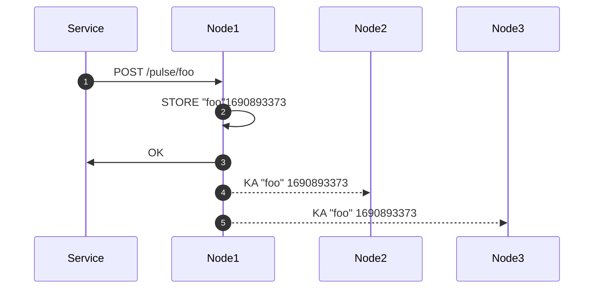
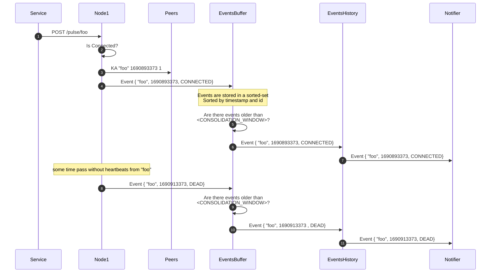
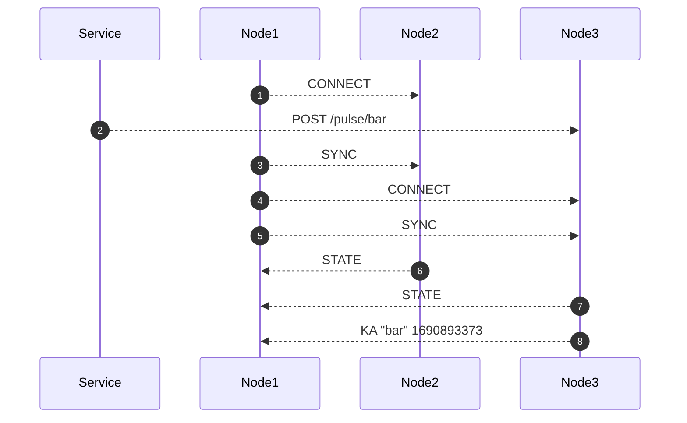
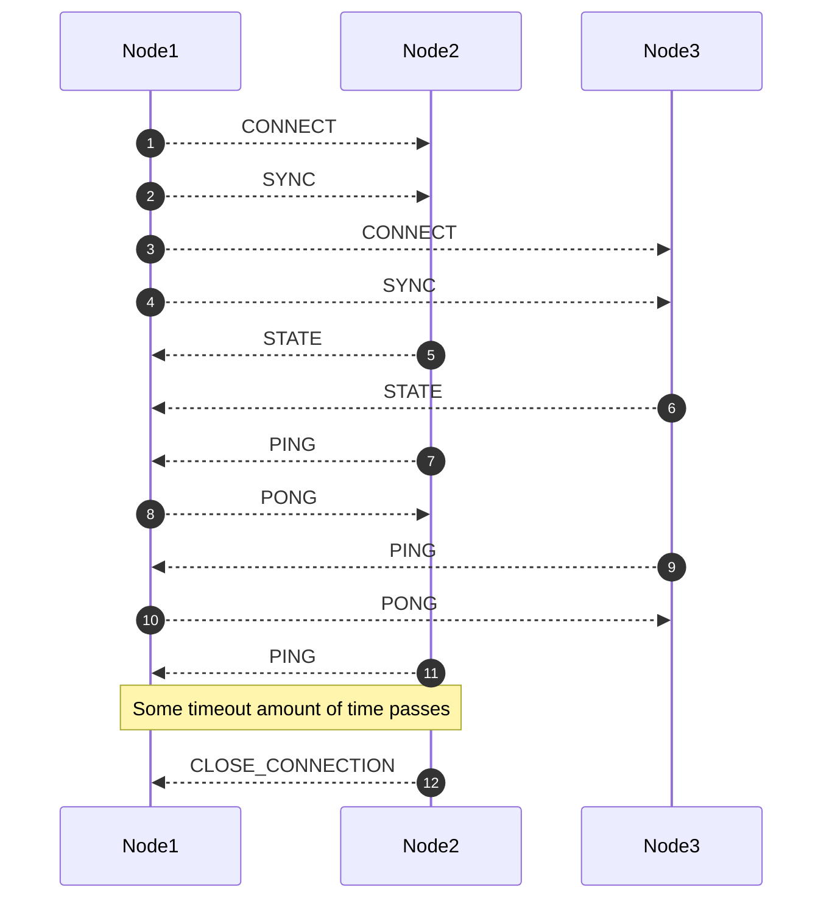

Distributed heartbeat tracking service in Rust. 🦀

⚠️ This is a work in progress, don't use in production yet ⚠️

# What?

`beatboxer` is a service for collecting heartbeats/keep-alive messages from other services or devices.

# API

`POST /pulse/:id` - registers a heartbeat for device with `:id` (no body)

`GET /ka/:id` - gets the latest heartbeat for device with `:id`

# Notifications

Getting live updates about device `connecting` and `dying` (keep alives not received in a while)

`ws://host:port/updates` - start getting updates from now

`ws://host:port/updates?offset=1691517188570` - start getting updates from timestamp in the past, events history is currently hardcoded to last 500k events.

## Protocol
The protocol format currently looks like this:

```
1691517189761,foo,CONNECTED,CONNECTED
1691517191344,bar,CONNECTED,CONNECTED
1691517209761,foo,DEAD,DEAD
1691517211344,bar,DEAD,DEAD
1691517759461,baz,CONNECTED,CONNECTED
1691517779461,baz,DEAD,CONNECTED
```

Breakdown:

```
1691517779461 - event timestamp
baz           - event device id (what sent to /pulse/)
DEAD          - event type (DEAD/CONNECTED)
CONNECTED     - current state (DEAD/CONNECTED/UNKNOWN)
```

The event type (DEAD) is the event type at the time when the event happened, the last event kind (CONNECTED) is the state right now, at the moment of reading the history. This might be useful when the service reading the events goes offline and comes back, mean while a device might died and came back, you you'll get DEAD,CONNECTED which means at the time of timestamp it died (due to not sending heartbeats) but right now it's alive, so for example the service watching these events might want to react differently.

## Offsets

Currently storing offsets isn't implemented and it's the client's responsibility. But it's probably a good idea to store them since we can probably treat them like timestamps and store them in the same distributed hashmap we're using for the heartbeats.

Some options how to handle the offsets/commits (ideas):

* The websocket consumer can send `COMMIT` messages every now and again, indicating it's done handling messages up to this point.
* Long polling and `AUTO COMMIT`, client polls for new messages, and if enough time passed it's assumed the offset of the previous poll can be committed.
* Something like the previous option but with websockets, if user continues to receive messages, assume older messages can be committed. 

# Constrains and Assumptions

(It might work for other use cases, but these are the use case for which it was designed.)

* ~1M devices
* Device sends heartbeat every 10s
* Device id length ~15 bytes
* When asking about a heartbeat, it's ok to get stale data, but not older than the previous beat
* When device stops sending heartbeats, need to store the last heartbeat for a couple of minutes.
* We're storing `timestamps`, on reconciliation we can safely take the last one.

# Why?

A simpler solution would be to just use Redis and slap a `REST` API on top of it. While a single Redis is great, it's still a single point of failure, and Redis-Cluster might introduce more unwanted complexity and moving parts.

The above constrains and assumptions make the problem of a distribution system easier:

1. The total size of the data is around 20MB (before any optimization), so we can easily send the whole state to a new node when it joins.
1. If a node get multiple out of order updates about a device, it can always take the latest timestamp.
1. It's ok to lose heartbeats now and then because another one is probably coming (every 10s)
1. We have about 10s to finish sending an update from one node to the others because we can be stale up to 1 heartbeat from the last.

# How?

### High Level Design
* Multi leader cluster - all nodes are masters and accept pulses
* The node taking the pulse generates the timestamp and sends to all other nodes
* All nodes are connected to all other nodes
* Since the values are timestamp, in case of conflicts last write wins. (highest timestamp)
* Connected events are also by the master receiving the pulse and forwarded to all nodes
* Dead events are decided by each node independently and are not replicated, but since they're derived from the same state, they should be identical on all nodes
* Before events written to events history and consumers (via websocket) get notified, the events are stored in a buffer with some time delay - this allows enough time for events from other peers to arrive, the buffer is sorted (and should be reconciliated) before pushing to events history.

### Update Flow

1. services sends a `POST` request to any of the nodes (in this case node1) with the device id `foo`
1. `node1` creates a `timestamp` now and stores it locally
1. `node1` returns OK
1. `node1` forwards the heartbeat to `node2`
1. `node2` forwards the heartbeat to `node3`

tl;dr a `node` will send updates to all other `nodes` connected to it.

Conflict Resolution: Nodes might get `KA` updates from other nodes out of order because of delays between the noes, in this case the conflict resolution is simple: since the data itself is a timestamp, a node will always store the biggest number, so if it got a ts 20, but it already stores ts 30, it will just drop the update.

For events history conflict resolution is a bit tricker:

### Events History


1. Services sends a `POST` request to any of the nodes (in this case `Node1`) with the device id `foo`
1. `Node1` checks if this is a connected events - first heartbeat seen from foo, or enough duration passed between the last heartbeat that it was considered dead and not it's connected again.
1. `Node1` forwards the heartbeat and a flag if it's a connection event to all peers
1. A `CONNECTED` event about foo is written to the `EventsBuffer` which is a sorted-set that keeps events sorted by their timestamps, this is important because each node constantly gets events from other peers and they might come out of order because of delays between nodes.
1. Periodically the sorted set is checked for events that are older than the `CONSOLIDATION_WINDOW` 
1. These events had enough time to sit in the buffer so any lagging events of that are in the past should have already arrived, these events are sorted again also by `id` so that the `EventHistory` looks the same on all nodes, after that the events are written to `EventsHistory`
1. And once event hits EventsHistory it's also published to any current subscribers (currently via websockets).
1. If after `DEAD_DEVICE_TIMEOUT` no new heartbeats arrive from `foo` it's then considered `DEAD` and a `DEAD` events is appended to the `EventsBuffer` - note that the dead events aren't forwarded to the other peers, it's assumed that since they all have the same state they should all arrive to the same conclusions about the dead-ness of nodes.
1. The dead event sits in the buffer until enough time had passed.
1. And then forwarded to `EventsHistory`,
1. And from there notifies any subscribers.

### New node joins


`node1` joins the cluster

1. `node1` connects to `node2` (node2 starts buffering update events for node1)
1. services send `POST` to any of the nodes, with the device id `bar`
1. `node1` sends `SYNC` to `node2`
1. `node1` connects to `node3` (node3 starts buffering update events for node1)
1. `node1` sends `SYNC` to `node3`
1. `node2` sends full state update (dump) to `node1`
1. `node3` sends full state update (dump) to `node1`
1. `node3` now forwards the update about `bar` that it kept between `node1` being connected and `node1` being synched

# Keep alives between nodes


After the initial `SYNC-STATE`, every node starts sending `PING` to all the nodes that are connected to it, these nodes should respond with `PONG`, if they fail to respond after some time, the nodes closes the connection and they need to reconnect.

# Readiness

Each cluster node exposes a `GET /ready` endpoint that returns `200 OK` when node is ready to start serving. This endpoint intendant to be used as a `readiness probe` under a Kubernetes Service.


The readiness heuristic works as follows:

1. Each node has a configurable list of peers.
1. When node starts, all peer status is set to `INITIALIZING`.
1. The node attempts to connect to each peer.
1. If node fails to connect to a peer, its status set to `DEAD`.
1. If node connects to a peer but fails to sync, its status set to `SYNC_FAILED`.
1. If sync is successful, its status is `SYNCHED`.

A node is ready when all it's peers isn't in the `INITIALIZING` state, so either dead, synched, or failed sync.

Note 1: in case of a failed sync, the node will disconnect from that peer and try connecting and synching again and again for ever.

Note 2: The idea is that a node shouldn't accept http calls until it's done serving, but this isn't currently enforced unless the cluster running inside a k8s service.

# Liveness

Each cluster node exposes a `GET /ping` endpoint that returns `200 PONG` when node is alive. This endpoint intendant to be used as a `liveness probe` under a Kubernetes Service.

# Cluster Status

Each cluster node exposes a `GET /cluster_status` that returns information about the node and its peers:

```json
{
  "up_since": "2023-08-12T14:36:47.061589Z",
  "nodes": {
    "127.0.0.1:5502": {
      "status": "SYNCHED",
      "status_since": "2023-08-12T14:36:48.065119Z",
      "last_ping": "2023-08-12T21:11:04.265606Z",
      "last_sync": "2023-08-12T14:36:48.065120Z"
    },
    "127.0.0.1:5501": {
      "status": "SYNCHED",
      "status_since": "2023-08-12T14:36:47.062256Z",
      "last_ping": "2023-08-12T21:11:04.265359Z",
      "last_sync": "2023-08-12T14:36:47.062256Z"
    }
  }
}
```

# Limitations and potential problems

1. Doing two `GET`s to two different instances doesn't guarantee the same result 
1. In case of a long period of network partition nodes will go out of sync, this can be addressed by sending more frequent keep alive messages.
1. If for example you have 8 nodes and you have a network split between 6 and 2 of the nodes, if we implement peer discovery with `etcd` each node can know if it's in the majority group or not, and if not stop serving until it reconnects, because we don't have a external registry and if we're the `2` noes that don't see the `6` we can't know if it's because of a network thing or they're really down.
1. It's not clear what the effect of slowness in the replication, currently messages are being buffered, and we have a keep alive to kill dead nodes, but it's still something we should test.


# Persistency

Currently `beatboxer` supports an optional persistency to disk with `rocksdb`, this is enabled with `--use-rocksdb` but there's a significant performance penalty compared with the default in-memory store.

*NOTE:* Notifications haven't been implemented for persistent storage yet!.

# Monitoring

Each node exports a prometheus endpoint `/metrics` with HTTP times and messages latency between the nodes.

# Running

To run a cluster locally (on dev machine)

```bash

export IS_DEV=1
export H=`hostname`
export RUST_LOG=beatboxer=info,info 

# node 1
cargo run --release --bin beatboxer -- --listen-addr 127.0.0.1  -n $H:5500 -n $H:5501 -n $H:5502 --http-port 8080 --listen-port 5500

# node 2
cargo run --release --bin beatboxer -- --listen-addr 127.0.0.1  -n $H:5500 -n $H:5501 -n $H:5502 --http-port 8081 --listen-port 5501

# node 3
cargo run --release --bin beatboxer -- --listen-addr 127.0.0.1  -n $H:5500 -n $H:5501 -n $H:5502 --http-port 8082 --listen-port 5502
```

# Configuration 

The following environment variables are used to set internal timeouts:

* `SOCKET_WRITE_TIMEOUT_MS`:  writing to socket timeout - default 1s
* `SOCKET_WRITE_LONG_TIMEOUT_MS`: writing big payload to socket - default 10s
* `SOCKET_READ_LONG_TIMEOUT_MS`: reading from socket, large payload - default 10s
* `LAST_PONG_TIMEOUT_MS`: duration between ping-pong to considered as timeout and disconnect node - default 10s
* `DEAD_DEVICE_TIMEOUT_MS`: duration between heartbeats to consider device as `DEAD`
* `CONSOLIDATION_WINDOW_MS`: how long to delay notification to consolidate out of order writes from other peer ndoes.

# Consistency/Stress Test

To make sure everything works a `stress_test` can be run:

```bash
$ cargo run --release --bin stress_test --featrues=stress_test -- -h

Usage: stress_test [OPTIONS] --nodes <NODES>

Options:
  -n, --nodes <NODES>
      --pulse-workers <PULSE_WORKERS>          [default: 100]
      --check-workers <CHECK_WORKERS>          [default: 100]
      --pulses-per-worker <PULSES_PER_WORKER>  [default: 30000]
  -h, --help                                   Print help
```

It does the following things:

1. Takes a list of cluster nodes
1. Starts `pulse-workers` number of pulse workers that send `pulses-per-worker` pulses for randomly generated ids
1. An event containing the `id` and the `node` the pulse worker sent the pulse to is then sent to a `check` worker
1. The check worker removes this node from list of nodes, and randomly selects one of the other nodes
1. It then does a `GET /ka/{id}` from that node, with multiple attempts and waits between them
1. This is meant to check that when sending a pulse to one node, it is eventually seen on another node, the latency it takes to get to the other node is logged.
1. After all pulsers/checkers are done, the latency percentiles are reported.
1. In parallel to all of this there's a `websocket client` connected to each node
1. Each client checks that a `DEAD` event didn't arrive before an `CONNECTED` event, and that for each `CONNECTED` event there's a dead event
1. It also checks that the number of `CONNECTED-DEAD` pairs is the same as the number of random ids generated by the pulser.
1. Finally each `websocket client` returns the whole list of events it got from the node, and this list is compared with the other nodes
1. This checks that all websockets from all nodes got the same messages in the same order.

```
$ cargo run --release --bin stress_test --featrues=stress_test -- -n localhost:8080 -n localhost:8081 -n localhost:8082

2023-08-15T07:39:00.203835Z  INFO stresser: starting stress test. config: Config { nodes: ["localhost:8080", "localhost:8081", "localhost:8082"], pulse_workers: 100, check_workers: 100, pulses_per_worker: 30000 }
2023-08-15T07:40:40.515422Z  INFO stresser: p(25.0): low: 5 high: 5 count: 503041
2023-08-15T07:40:40.515424Z  INFO stresser: p(50.0): low: 7 high: 7 count: 358921
2023-08-15T07:40:40.515426Z  INFO stresser: p(90.0): low: 14 high: 14 count: 51953
2023-08-15T07:40:40.515428Z  INFO stresser: p(99.0): low: 34 high: 35 count: 4799
2023-08-15T07:40:40.515429Z  INFO stresser: p(99.9): low: 72 high: 75 count: 587
2023-08-15T07:41:10.518074Z  INFO stresser: waiting for ws clients to finish
2023-08-15T07:41:10.518090Z  INFO stresser: closing ws://localhost:8081/updates ws!
2023-08-15T07:41:10.518090Z  INFO stresser: closing ws://localhost:8082/updates ws!
2023-08-15T07:41:10.518090Z  INFO stresser: closing ws://localhost:8080/updates ws!
2023-08-15T07:41:12.735107Z  INFO stresser: ws://localhost:8080/updates - for each connect there's a dead.
2023-08-15T07:41:12.735128Z  INFO stresser: ws://localhost:8080/updates - got expected number of pairs 3000000
2023-08-15T07:41:12.736686Z  INFO stresser: ws://localhost:8081/updates - for each connect there's a dead.
2023-08-15T07:41:12.736698Z  INFO stresser: ws://localhost:8081/updates - got expected number of pairs 3000000
2023-08-15T07:41:12.744505Z  INFO stresser: ws://localhost:8082/updates - for each connect there's a dead.
2023-08-15T07:41:12.744517Z  INFO stresser: ws://localhost:8082/updates - got expected number of pairs 3000000
2023-08-15T07:41:19.006878Z  INFO stresser: comparing the counters from ws clients
2023-08-15T07:41:19.888353Z  INFO stresser: events are equal
2023-08-15T07:41:21.753978Z  INFO stresser: events are equal
```

# What's missing
1. Data compaction when sending `SYNC` between nodes.
1. Getting peers from `etcd` / `consul`
1. Some sort of a `COMMIT` mechanism for notification offsets, maybe long polling, maybe storing consumer group offsets like kafka?
1. event history reconciliation, if we get into a situation we have multiple `CONNECTED` events from the same id, we should just take the first one
1. Move all the configuration from constant to proper config and allow stuff to come from env variables

