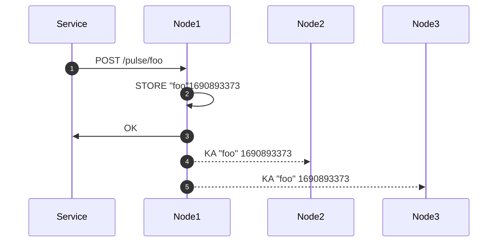
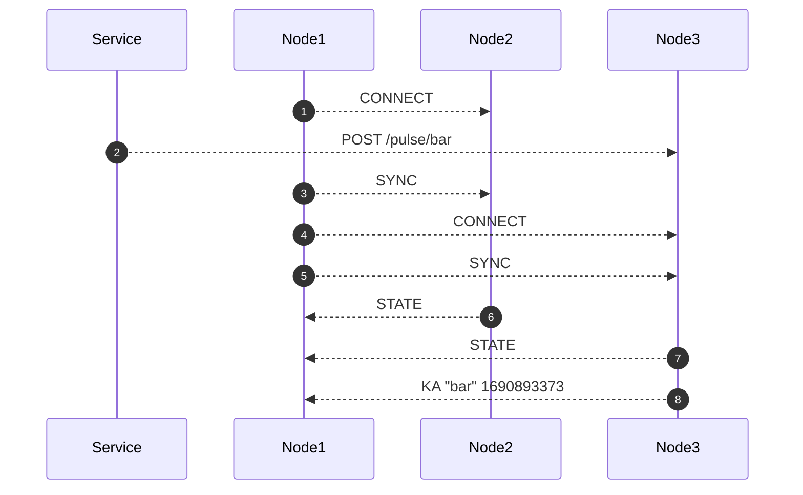
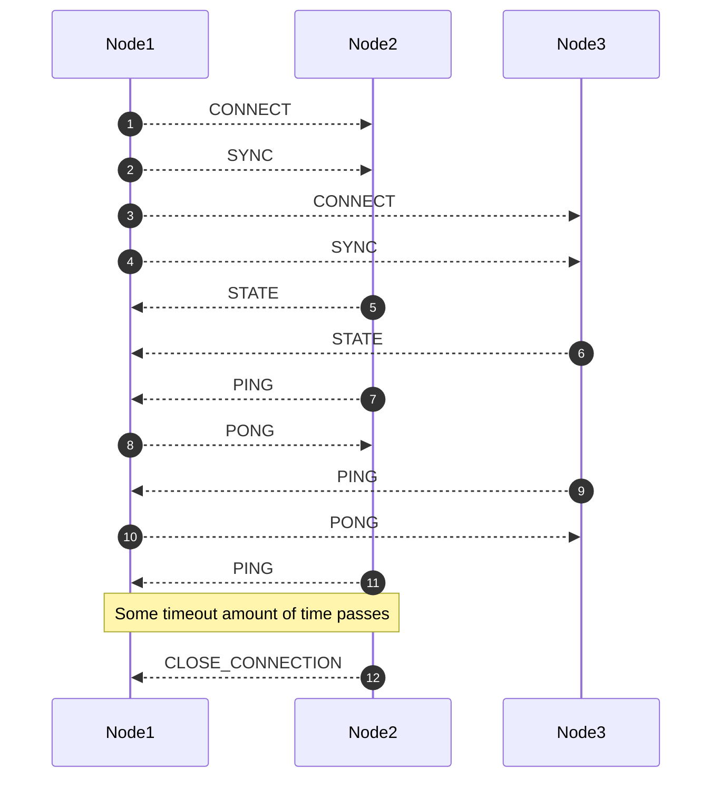

# Beat Boxer

Distributed heartbeat tracking service in Rust.

⚠️ This is a work in progress, don't use in production yet ⚠️

# What?

`beatboxer` is a service for collecting heartbeats/keep-alive messages from other services or devices.

# API

`POST /pulse/:id` - registers a heartbeat for device with `:id` (no body)

`GET /ka/:id` - gets the latest heartbeat for device with `:id`

# Future API

Expose a stream of changes, for example device becomes a live, device disconnects, device died. this will probably be a rabbitmq publisher, but other interfaces are possible too, for example kafka, or even connecting via websocket and getting events.

Currently only the RabbitMQ one is planned.

# Constrains and Assumptions

(It might work for other use cases, but these are the use case for which it was designed.)

* ~1M devices
* Device sends heartbeat every 10s
* Device id length ~15 bytes 
* When asking about a heartbeat, it's ok to get stale data, but not older than the previous beat
* When device stops sending heartbeats, need to store the last heartbeat for a couple of minutes.
* We're storing `timestamps`, on reconciliation we can safely take the last one.

# Why?

A simpler solution would be to just use Redis and slap a `REST` API on top of it. While a single Redis is great, it's still a single point of failure, and Redis-Cluster might introduce more unwanted complexity and moving parts.

The above constains and assumptions make the problem of a distribution system easier:

1. The total size of the data is around 20MB (before any optimization), so we can easily send the whole state to a new node when it joins.
1. If a node get multiple out of order updates about a device, it can always take the latest timestamp.
1. It's ok to lose heartbearts now and then because another one is probably coming (every 10s)
1. We have about 10s to finish sending an update from one node to the others because we can be stale up to 1 hearbeat from the last.

# How?

### Update Flow

1. services sends a `POST` request to any of the nodes (in this case node1) with the device id `foo`
1. `node1` creates a `timestamp` now and stores it locally
1. `node1` returns OK
1. `node1` forwards the heartbeat to `node2`
1. `node2` forwards the heartbeat to `node3`

tl;dr a `node` will send updates to all other `nodes` connected to it.

### New node joins

`node1` joins the cluster

1. `node1` connects to `node2` (node2 starts buffering update events for node1)
1. services send `POST` to any of the nodes, with the device id `bar`
1. `node1` sends `SYNC` to `node2`
1. `node1` connects to `node3` (node3 starts buffering update events for node1)
1. `node1` sends `SYNC` to `node3`
1. `node2` sends full state update (dump) to `node1`
1. `node3` sends full state update (dump) to `node1`
1. `node3` now forawrds the update about `bar` that it kept between `node1` being connected and `node1` being synched

# Keep alives between nodes

After the initial `SYNC-STATE`, every node starts sending `PING` to all the nodes that are connected to it, these nodes should respond with `PONG`, if they fail to respond after some time, the nodes closes the connection and they need to reconnect.

# Readiness

It's not clear at which stage to become ready. 
1. A node should become ready after it has `SYNC`ed with all the peers that are alive.
1. But if we assume nodes are mostly up-to-date, then a `SYNC` with any of the nodes should be enough
1. Another option is to try to `SYNC` with all peers, and become ready if one of the following happens: `SYNC` success with all nodes, or timeout of say `10s`
1. Variation on that would be to first determine which peers are alive, and then to wait for a `SYNC` with all active peers.

# Limitations and potential problems

1. Doing two `GET`s to two different instances doesn't guarantee the same result 
1. In case of a long period of network partition nodes will go out of sync, this can be addressed by sending more frequent keep alives
1. If for example you have 8 nodes and you have a network split between 6 and 2 of the nodes, if we implement peer discovery with `etcd` each node can know if it's in the majority group or not, and if not stop serving until it reconnects, because we don't have a external registry and if we're the `2` noes that don't see the `6` we can't know if it's because of a network thing or they're really down.
1. It's not clear what the effect of slowness in the replication, currently messages are being buffered, and we have a keep alive to kill dead nodes, but it's still something we should test.

# Persistency

Currently `beatboxer` supports an optional persistency to disk with `rocksdb`, this is enabled with `--use-rocksdb` but there's a significant performance penalty compared with the default in-memory store.

# Monitoring

Each node exports a prometheus endpoint `/metrics` with HTTP times and messages latency between the nodes.

# What's missing
1. Data compection when sending `SYNC` between nodes.
1. Getting peers from `etcd` / `consul`
1. Add `/ready` readiness probe, to make the node *ready* only after it done the `SYNC`
1. Add another storage mode using `skip-lists` / `sorted-set`, storing the heartbeats sorted by time allows polling efficiently for devices that haven't sent a heartbeat in a while, and to output an event when a device is `DEAD` or `CONNECTED` when it starts sending heartbeats again.
1. Handle when downstream nodes are too slow and channels are full, it shouldn't make the handler hang, maybe best to disconnect the node in this case.
